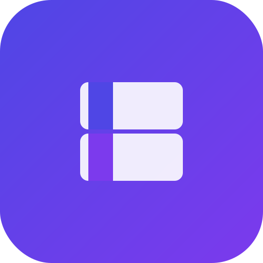

# SoftSell - Software License Resale Platform

<div align="center">
  
</div>

SoftSell is a modern web application that helps businesses recover value from their unused or excess software licenses with transparent, secure, and efficient resale solutions.

## Features

- **Expert Valuation**: Our team of license experts ensures you receive the maximum value for your software assets
- **Secure Transactions**: End-to-end encrypted transactions with verified buyers
- **24-hour Valuation**: Quick turnaround on license valuations
- **No Upfront Fees**: Pay only when your licenses sell

## Tech Stack

- **Frontend**: React 19, TypeScript, Tailwind CSS
- **UI Components**: Shadcn UI
- **Animations**: Framer Motion
- **Form Handling**: React Hook Form with Zod validation
- **State Management**: React Query
- **Routing**: React Router
- **API Integration**: Gemini AI for chat support

## Getting Started

### Prerequisites

- Node.js 18+
- Bun or npm package manager

### Installation

1. Clone the repository

   ```bash
   git clone https://github.com/yourusername/soft-sell.git
   cd soft-sell
   ```

2. Install dependencies

   ```bash
   # Using Bun:
   bun install

   # Or using npm:
   npm install
   ```

3. Set up environment variables

   ```bash
   cp .env.example .env.local
   ```

   Add your Gemini API key and URL to the .env file

4. Start the development server

   ```bash
   # Using Bun:
   bun dev

   # Or using npm:
   npm run dev
   ```

## Project Structure

```
soft-sell/
├── public/               # Static assets
│   └── favicon.svg       # Custom SoftSell favicon
├── src/                  # Source code
│   ├── components/       # UI components
│   │   ├── motion/       # Reusable motion components
│   │   └── ui/           # Shadcn UI components
│   ├── hooks/            # Custom React hooks
│   ├── lib/              # Utility functions and constants
│   ├── pages/            # Page components
│   ├── services/         # API services (Gemini AI integration)
│   ├── App.tsx           # Main application component
│   ├── env.ts            # Environment variables validation
│   ├── index.css         # Global styles
│   └── main.tsx          # Application entry point
├── .env.example          # Example environment variables
├── components.json       # Shadcn UI configuration
├── eslint.config.js      # ESLint configuration
├── index.html            # HTML entry point
├── package.json          # Project dependencies and scripts
├── tsconfig.json         # TypeScript configuration
├── vite.config.ts        # Vite configuration
└── README.md             # Project documentation
```

### Key Components

- **Navbar**: Main navigation with responsive mobile menu
- **Hero**: Landing section with main call-to-action
- **HowItWorks**: Step-by-step process explanation
- **WhyChooseUs**: Benefits and features highlights
- **Testimonials**: Customer reviews and feedback
- **ContactForm**: Contact form with validation
- **ChatWidget**: AI-powered chat assistant using Gemini API
- **Footer**: Site footer with links and contact information

## Contributing

Contributions are welcome! Please feel free to submit a Pull Request.

1. Fork the repository
2. Create your feature branch (`git checkout -b feature/amazing-feature`)
3. Commit your changes (`git commit -m 'Add some amazing feature'`)
4. Push to the branch (`git push origin feature/amazing-feature`)
5. Open a Pull Request
